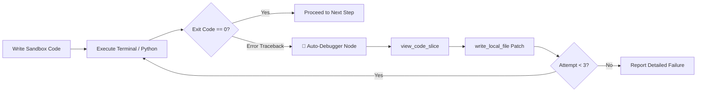

# 🚀 Zero-Cost ($0 / No Credit Card) Improvement Blueprint for Local Agentic RAG

A comprehensive, production-grade architectural guide and enhancement roadmap for the **Local Agentic RAG** system. Every improvement in this blueprint uses **100% open-source, local, or free-tier technologies** that require **no financial cost and zero credit cards**.

---

## 📑 Table of Contents
1. [Executive Summary & Current Architecture](#1-executive-summary--current-architecture)
2. [Status of Completed Phase 1 Improvements](#2-status-of-completed-phase-1-improvements)
3. [Category 1: Zero-Downtime Multi-Provider LLM Fallbacks](#3-category-1-zero-downtime-multi-provider-llm-fallbacks)
4. [Category 2: Autonomous Re-Planning & Self-Correction Loops (Reflexion)](#4-category-2-autonomous-re-planning--self-correction-loops-reflexion)
5. [Category 3: Hierarchical Multi-Turn Memory & Semantic Vector Chat Cache](#5-category-3-hierarchical-multi-turn-memory--semantic-vector-chat-cache)
6. [Category 4: Local Vision & Diagram Analysis ($0 Cost via Moondream2 / Qwen2-VL)](#6-category-4-local-vision--diagram-analysis-0-cost-via-moondream2--qwen2-vl)
7. [Category 5: Lightweight GraphRAG (Knowledge Graph Triples via NetworkX)](#7-category-5-lightweight-graphrag-knowledge-graph-triples-via-networkx)
8. [Category 6: Interactive Artifact & Code Diff Explorer in Streamlit](#8-category-6-interactive-artifact--code-diff-explorer-in-streamlit)
9. [Category 7: Automated Evaluation Benchmark Suite ($0 LLM-as-a-Judge)](#9-category-7-automated-evaluation-benchmark-suite-0-llm-as-a-judge)
10. [Prioritized Implementation Roadmap](#10-prioritized-implementation-roadmap)

---

## 1. Executive Summary & Current Architecture

```mermaid
flowchart TD
    subgraph Active_Architecture [Production Agentic Architecture]
        UI[ui/app.py (Streamlit UI with Live Observability & Token Streaming)] --> Graph[src/agent/graph.py (LangGraph StateGraph)]
        Graph --> Supervisor[Lead Agent / Supervisor Node]
        Supervisor --> Tools{Agent Tools Node}
        
        Tools --> HybridRAG[src/tools/rag_tool.py (BM25 + Chroma Dense via RRF)]
        HybridRAG --> Reranker[src/rag/reranker.py (Cross-Encoder ms-marco-MiniLM)]
        Reranker --> CRAG[grade_retrieval_node (Self-RAG / Corrective Grader)]
        
        Tools --> MCP[src/tools/mcp_tool.py (JSON-RPC 2.0 SQLite Server)]
        Tools --> Coding[src/tools/coding_tools.py (Tree, Grep, Slice, Python REPL, Shell Sandbox)]
        Tools --> Subagents[src/agent/subagents.py (Parallel Subagent Fan-Out)]
        
        Subagents -- OLLAMA_NUM_PARALLEL=4 --> Sub1[Researcher Subagent]
        Subagents -- OLLAMA_NUM_PARALLEL=4 --> Sub2[Coder Subagent]
        Subagents -- OLLAMA_NUM_PARALLEL=4 --> Sub3[Data Analyst Subagent]
        Subagents -- OLLAMA_NUM_PARALLEL=4 --> Sub4[RAG Specialist Subagent]
    end
```

---

## 2. Status of Completed Phase 1 Improvements

| Feature | Description | Status |
| :--- | :--- | :--- |
| **Streamlit Live Tool Observability** | Interactive `st.status` streaming showing thoughts, tool calls, and outputs in real-time. | ✅ **Completed & Shipped** |
| **UI Document Upload & Ingestion Manager** | Multi-format drag-and-drop indexer (`.pdf`, `.txt`, `.md`, `.csv`, `.json`, `.py`) with ChromaDB live stats. | ✅ **Completed & Shipped** |
| **Local Cross-Encoder Reranker** | Second-stage `cross-encoder/ms-marco-MiniLM-L-6-v2` relevance scoring on CPU (<40ms). | ✅ **Completed & Shipped** |
| **Hybrid Search (BM25 + Dense RRF)** | Okapi BM25 sparse keyword search + Chroma dense embeddings merged with Reciprocal Rank Fusion. | ✅ **Completed & Shipped** |
| **Self-RAG / CRAG Grader Node** | LangGraph evaluation node detecting low-confidence retrievals and routing to web search fallbacks. | ✅ **Completed & Shipped** |
| **Workspace Sandboxing & Codebase Tools** | `list_directory_tree`, `grep_search`, `view_code_slice`, `find_files_by_pattern` sandboxed in `./workspace`. | ✅ **Completed & Shipped** |
| **Streaming Token Response** | Character-by-character real-time LLM token generation with typing cursor. | ✅ **Completed & Shipped** |
| **Parallel Subagent Fan-Out / Fan-In** | Multi-slot concurrent subagents exploiting `OLLAMA_NUM_PARALLEL=4` GPU slots simultaneously. | ✅ **Completed & Shipped** |
| **Real MCP SQLite Introspection Server** | Official JSON-RPC 2.0 protocol server with table discovery, schema inspection, and read-only guards. | ✅ **Completed & Shipped** |

---

## 3. Category 1: Zero-Downtime Multi-Provider LLM Fallbacks

### 🎯 The Problem
Relying solely on an ngrok tunnel to a remote Kaggle/Colab notebook means an expired session or network hiccup halts the entire application.

### 💡 The $0 Zero-Credit-Card Solution
Implement an **Automatic Multi-Provider Failover LLM Chain** with zero-cost free tiers:
1. **Primary**: Local / Remote Ollama (`qwen3.8:27b` via ngrok)
2. **Fallback 1 (Blazing Fast Free Tier)**: **Groq Free API** (`llama-3.3-70b-versatile` / `mixtral-8x7b-32768`) — *100% Free, no credit card required, 30 requests/min, 14,400 requests/day, 300+ tokens/sec*.
3. **Fallback 2 (High Intelligence Free Tier)**: **Google Gemini 1.5 Flash Free API** (Google AI Studio) — *100% Free, no credit card required, 15 requests/min, 1,000,000 tokens/min free tier*.
4. **Fallback 3 (Local CPU Backup)**: Local lightweight Ollama (`llama3.2:1b` or `qwen2.5:1.5b`) running locally on CPU.

```mermaid
flowchart TD
    Request[User Query / Subagent Task] --> Router[LLM Provider Router]
    
    Router --> TryPrimary{1. Ollama via ngrok}
    TryPrimary -- Success --> Return[Stream Output]
    TryPrimary -- Error / Timeout / 500 --> Fallback1{2. Groq Free Tier (Llama-3.3-70B)}
    
    Fallback1 -- Success --> Return
    Fallback1 -- Rate Limit / Error --> Fallback2{3. Gemini 1.5 Flash Free Tier}
    
    Fallback2 -- Success --> Return
    Fallback2 -- Error --> Fallback3[4. Local CPU Model (Qwen2.5-1.5B)]
```

### 💻 Code Implementation Pattern
```python
import os
from langchain_openai import ChatOpenAI
from langchain_google_genai import ChatGoogleGenerativeAI
from langchain_core.language_models.chat_models import BaseChatModel

def get_resilient_llm() -> BaseChatModel:
    """Builds a multi-provider fallback model chain with 100% free providers."""
    # 1. Primary: Remote Ollama
    ollama_llm = ChatOpenAI(
        model=os.getenv("LLM_MODEL", "qwen3.8:27b"),
        base_url=os.getenv("LLM_BASE_URL", "http://localhost:11434/v1"),
        api_key=os.getenv("LLM_API_KEY", "ollama"),
        temperature=0.4,
        timeout=15.0
    )
    
    fallbacks = []
    
    # 2. Fallback 1: Groq Free API (No Credit Card)
    groq_api_key = os.getenv("GROQ_API_KEY")
    if groq_api_key:
        groq_llm = ChatOpenAI(
            model="llama-3.3-70b-versatile",
            base_url="https://api.groq.com/openai/v1",
            api_key=groq_api_key,
            temperature=0.4
        )
        fallbacks.append(groq_llm)
        
    # 3. Fallback 2: Google Gemini 1.5 Flash (No Credit Card)
    gemini_api_key = os.getenv("GEMINI_API_KEY")
    if gemini_api_key:
        gemini_llm = ChatGoogleGenerativeAI(
            model="gemini-1.5-flash",
            google_api_key=gemini_api_key,
            temperature=0.4
        )
        fallbacks.append(gemini_llm)
        
    if fallbacks:
        return ollama_llm.with_fallbacks(fallbacks)
    return ollama_llm
```

---

## 4. Category 2: Autonomous Re-Planning & Self-Correction Loops (Reflexion)

### 🎯 The Problem
When the agent writes complex code or executes multi-step scripts, errors (syntax mistakes, missing imports, assertion failures) cause the task to fail abruptly.

### 💡 The $0 Solution: Test-Driven Auto-Debugging Node
Introduce a **Reflexion Auto-Fix Loop** in LangGraph:
1. When `execute_terminal_command` or `execute_python_code` returns an exit code $\neq 0$ or an exception traceback:
2. The graph routes to a **`code_debugger_node`**:
   - Parses the traceback and identifies the exact line number.
   - Uses `view_code_slice` to inspect the faulty snippet.
   - Automatically writes a patch via `write_local_file`.
   - Re-runs the execution up to 3 attempts.



---

## 5. Category 3: Hierarchical Multi-Turn Memory & Semantic Vector Chat Cache

### 🎯 The Problem
Long chat histories cause context window overflow, high latency, and memory drift. Simple truncation loses important user constraints stated earlier in the conversation.

### 💡 The $0 Solution
1. **Sliding Window with Recursive Background Summarization**:
   - Keep the most recent 6 messages verbatim.
   - Compress older messages into a rolling `conversation_summary` using a fast local model.
2. **Episodic Long-Term Vector Memory**:
   - Store user preferences, key project facts, and past decisions in a dedicated Chroma collection `chat_episodic_memory`.
   - Before answering, the agent performs a similarity search over past sessions to recall user-specific context!

---

## 6. Category 4: Local Vision & Diagram Analysis ($0 Cost via Moondream2 / Qwen2-VL)

### 🎯 The Problem
Users frequently have visual data: architecture diagrams, workflow screenshots, UI wireframes, or error dialogs that text-only agents cannot parse.

### 💡 The $0 Solution
Add a local visual understanding tool `analyze_image(image_path, query)`:
- **Model**: `moondream2` (1.8GB in Ollama) or `qwen2.5-coder:7b-instruct` / `qwen2-vl` running directly in the Ollama notebook.
- **Alternative Free Tier**: Gemini 1.5 Flash Free API supports image attachments with zero cost.
- **Streamlit Integration**: Add an image upload box in the chat interface where users can drag in screenshots.

---

## 7. Category 5: Lightweight GraphRAG (Knowledge Graph Triples via NetworkX)

### 🎯 The Problem
Vector search answers questions about *individual passages*, but struggles with multi-hop relational questions (e.g. *"What projects are managed by departments that have a budget exceeding $500,000?"*).

### 💡 The $0 Solution: In-Memory Knowledge Graph
- Use `networkx` (pure Python, $0 cost, zero database setup) to build an in-memory knowledge graph from ingested documents:
  - Extract entity triples `(Subject, Predicate, Object)` during document ingestion.
  - Store entity nodes and relational edges in NetworkX.
- Combine **Graph Traversal (Multi-Hop)** with **Chroma Vector Retrieval** for Hybrid GraphRAG!

---

## 8. Category 6: Interactive Artifact & Code Diff Explorer in Streamlit

### 🎯 The Problem
Files generated by the agent in `./workspace` require users to open an external IDE or file explorer to inspect changes.

### 💡 The $0 Solution: In-Browser Artifact Workbench in Streamlit
Add an interactive **Artifact Workbench Tab** in `ui/app.py`:
- **Code Viewer**: Live Monaco-style syntax highlighting for Python, JavaScript, HTML/CSS, SQL, Markdown.
- **Side-by-Side Diff Viewer**: Visual before-and-after comparison showing code diffs.
- **One-Click Actions**:
  - 📥 *Download Generated File*
  - ⚡ *Run in Sandbox Terminal*
  - 📋 *Copy to Clipboard*

---

## 9. Category 7: Automated Evaluation Benchmark Suite ($0 LLM-as-a-Judge)

### 🎯 The Problem
It is difficult to quantitatively measure whether prompt changes or new retrieval pipelines improve or degrade answer accuracy.

### 💡 The $0 Solution: Local Ragas-Style Evaluation Suite
Create `src/eval/benchmark.py` running 100% free local evaluations:
1. **Faithfulness Score (0–1.0)**: Checks whether every claim in the generated answer is strictly grounded in retrieved Chroma chunks (hallucination detector).
2. **Answer Relevance Score (0–1.0)**: Checks whether the response directly answers the user's intent.
3. **Retrieval Precision & Recall**: Tests top-1, top-3, and top-5 chunk relevance.
4. Outputs a visual markdown report with evaluation tables and latency breakdown.

---

## 10. Prioritized Implementation Roadmap

| Priority | Feature | Complexity | Value |
| :---: | :--- | :---: | :--- |
| **P1** | **Multi-Provider Free LLM Fallback Chain** (Ollama $\to$ Groq $\to$ Gemini Flash) | Low | ⭐⭐⭐⭐⭐ *Eliminates all ngrok downtime* |
| **P1** | **Self-Correcting Code Auto-Debugger Loop** (Reflexion on failed execution) | Medium | ⭐⭐⭐⭐⭐ *Self-healing code execution* |
| **P2** | **Interactive Artifact & Code Diff Workbench in Streamlit UI** | Low | ⭐⭐⭐⭐ *Elevates portfolio presentation* |
| **P2** | **Hierarchical Context Summarizer & Episodic Memory Cache** | Medium | ⭐⭐⭐⭐ *Unbounded multi-turn conversations* |
| **P3** | **Local Vision & Screenshot Analysis** (`moondream2` / `qwen2-vl`) | Low | ⭐⭐⭐⭐ *Multi-modal comprehension* |
| **P3** | **Automated Local Evaluation Benchmark Suite** ($0 LLM-as-a-Judge) | Medium | ⭐⭐⭐⭐ *Quantitative evaluation metrics* |
| **P4** | **Lightweight NetworkX GraphRAG Triples Extractor** | High | ⭐⭐⭐ *Multi-hop relational reasoning* |

---

*Every item in this blueprint is 100% free, runs without credit cards, and is fully compatible with your current Ollama, LangGraph, and Streamlit architecture.*
