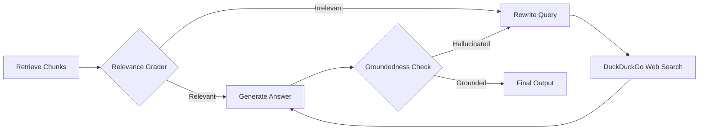
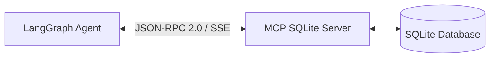

# 🚀 Zero-Cost ($0 / No Credit Card) Improvement Blueprint for Local Agentic RAG

A comprehensive, production-grade enhancement guide for the **Local Agentic RAG** project. Every recommendation below uses **100% open-source, local, or free-tier technologies** that require **no financial cost and no credit card**.

---

## 📑 Table of Contents
1. [Current Architecture Assessment](#1-current-architecture-assessment)
2. [Category 1: Advanced Agentic RAG Intelligence](#2-category-1-advanced-agentic-rag-intelligence)
3. [Category 2: Streamlit UI & Real-Time Agent Observability](#3-category-2-streamlit-ui--real-time-agent-observability)
4. [Category 3: True Model Context Protocol (MCP) Standards](#4-category-3-true-model-context-protocol-mcp-standards)
5. [Category 4: Resilient Free LLM Ecosystem & Context Management](#5-category-4-resilient-free-llm-ecosystem--context-management)
6. [Category 5: Developer Tooling, Web Intelligence & Sandboxing](#6-category-5-developer-tooling-web-intelligence--sandboxing)
7. [Category 6: Modern Dependencies & Code Hygiene](#7-category-6-modern-dependencies--code-hygiene)
8. [Prioritized Implementation Roadmap](#8-prioritized-implementation-roadmap)

---

## 1. Current Architecture Assessment

```mermaid
flowchart TD
    subgraph Current_State [Current Architecture]
        UI[ui/app.py (Streamlit Chat)] --> Graph[src/agent/graph.py (LangGraph StateGraph)]
        Graph --> LLM[ChatOpenAI / Ollama via ngrok]
        Graph --> Tools{Agent Tools}
        Tools --> RAG[src/tools/rag_tool.py -> ChromaDB]
        Tools --> MCP[src/tools/mcp_tool.py -> FastAPI REST /api/employees]
        Tools --> Coding[src/tools/coding_tools.py (Python REPL, Bash, File I/O)]
        Tools --> Web[src/tools/web_scraper.py + DuckDuckGo]
    end
```

### Key Technical Limitations
1. **RAG Retrieval Quality**: Naive top-$k$ dense similarity search (`k=3`) without reranking or hybrid search. Fails on exact keywords (IDs, error codes) and introduces semantic noise.
2. **Missing Feedback Loop (Self-RAG / CRAG)**: The agent has no self-correction mechanism when retrieved chunks are irrelevant, leading to hallucination.
3. **UI Observability**: The Streamlit interface displays an opaque `st.spinner("Agent is thinking...")`. Users cannot see agent reasoning, tool invocations, or retrieval latency.
4. **Pseudo-MCP Implementation**: The MCP server is currently a standard FastAPI HTTP REST endpoint, not adhering to the official JSON-RPC 2.0 / SSE / stdio Model Context Protocol standard.
5. **LLM Single Point of Failure**: Relies solely on an ngrok tunnel to a Kaggle/Colab notebook, which frequently expires or drops connections.
6. **Unbounded Context**: Unbounded message arrays risk Ollama Out-Of-Memory (OOM) errors during long conversations.

---

## 2. Category 1: Advanced Agentic RAG Intelligence

### A. Local Cross-Encoder Reranking ($0 Cost)
* **Problem**: Dense embeddings retrieve chunks that are semantically related in vector space but may not directly answer the question.
* **Solution**: Retrieve a wider pool (e.g. top-12 chunks) and pass them through a lightweight local cross-encoder (`cross-encoder/ms-marco-MiniLM-L-6-v2` via `sentence-transformers`).
* **Hardware Requirement**: Runs on CPU in <50ms.
* **Code Implementation Pattern**:

```python
from sentence_transformers import CrossEncoder

# Load model locally (cached after first run)
reranker = CrossEncoder("cross-encoder/ms-marco-MiniLM-L-6-v2")

def search_and_rerank(query: str, top_k: int = 3, initial_fetch: int = 12):
    vectorstore = get_vectorstore()
    candidate_docs = vectorstore.similarity_search(query, k=initial_fetch)
    
    if not candidate_docs:
        return []
        
    pairs = [[query, doc.page_content] for doc in candidate_docs]
    scores = reranker.predict(pairs)
    
    # Sort docs by cross-encoder score
    scored_docs = sorted(zip(candidate_docs, scores), key=lambda x: x[1], reverse=True)
    return [doc for doc, score in scored_docs[:top_k]]
```

---

### B. Hybrid Search: BM25 Sparse + Dense Chroma (Reciprocal Rank Fusion) ($0 Cost)
* **Problem**: Vector embeddings struggle with precise keyword queries (e.g. `Error code 403`, `EMP-9021`, specific variable names).
* **Solution**: Combine BM25 keyword search (`rank_bm25`) with Chroma vector search using Reciprocal Rank Fusion (RRF).

---

### C. Corrective RAG (CRAG) & Self-RAG Grader Node ($0 Cost)
* **Problem**: If documents in ChromaDB don't contain the answer, the LLM hallucinates rather than acknowledging the gap.
* **Solution**: Add a **Document Relevance Grader** step inside LangGraph:
  1. **Grade Chunks**: If relevant chunks >= 1, proceed to generation.
  2. **Fallback / Query Rewrite**: If 0 relevant chunks found, rewrite the query and trigger `web_search` automatically.
  3. **Hallucination Check**: Verify that the generated answer is grounded in the retrieved chunks.



---

## 3. Category 2: Streamlit UI & Real-Time Agent Observability

### A. Live Step & Tool Execution Visualizer (`st.status`)
Replace static spinners with real-time thought-streaming in `ui/app.py`:

```python
with st.chat_message("assistant"):
    with st.status("🤖 Agent is reasoning...", expanded=True) as status:
        for event in agent_app.stream(inputs, stream_mode="updates"):
            for node_name, node_output in event.items():
                if node_name == "action":
                    for msg in node_output.get("messages", []):
                        st.write(f"🛠️ **Tool Executed:** `{msg.name}`")
                        with st.expander("View Tool Payload"):
                            st.code(msg.content[:500])
                elif node_name == "agent":
                    st.write("🧠 **Analyzing & Formulating Response...**")
                    
        status.update(label="✅ Response Generated", state="complete", expanded=False)
```

---

### B. In-App Knowledge Base Manager (Drag & Drop Ingestion)
Add interactive vectorstore management directly to the Streamlit sidebar:
* **Upload Support**: Drag and drop `.pdf`, `.txt`, `.md`, `.csv`, `.docx`.
* **Database Stats**: Live badge showing total documents and chunk count.
* **Action Buttons**: **"Re-index Knowledge Base"** and **"Clear Database"**.

---

### C. LangGraph Multi-Session Checkpointing
Persist conversation history and enable multiple chat threads using LangGraph's built-in `MemorySaver` or `SqliteSaver`:

```python
from langgraph.checkpoint.memory import MemorySaver

memory = MemorySaver()
app = workflow.compile(checkpointer=memory)

# In Streamlit, each session has a unique thread_id:
config = {"configurable": {"thread_id": st.session_state.session_id}}
response = app.invoke(inputs, config=config)
```

---

## 4. Category 3: True Model Context Protocol (MCP) Standards

### Transition from Mock REST to Official MCP Python SDK
Currently, `src/mcp_server/server.py` is a plain FastAPI endpoint. Upgrading to the standard Model Context Protocol unlocks compatibility with the broader MCP ecosystem.



#### Key Capabilities to Add:
1. **Dynamic Schema Introspection**: Tool that allows the agent to inspect table structures (`PRAGMA table_info(employees)`) rather than hardcoded endpoints.
2. **Safe Dynamic SQL Querying**: Expose safe parameterized query execution.
3. **Transport Protocol**: Support both **stdio** (for local CLI agents) and **SSE** (Server-Sent Events) for networked agents.

---

## 5. Category 4: Resilient Free LLM Ecosystem & Context Management

### A. Zero-Cost, No-Credit-Card Provider Ecosystem
Instead of relying solely on temporary ngrok tunnels, provide instant switching between 100% free providers:

| Provider | Model | Latency | Credit Card Needed? | Setup |
| :--- | :--- | :--- | :---: | :--- |
| **Local Ollama** | `qwen2.5:7b`, `llama3.2:3b` | Medium | ❌ No | `http://localhost:11434/v1` |
| **Groq Cloud Free** | `llama-3.3-70b-versatile`, `qwen-2.5-32b` | ~300 tok/s | ❌ No | Free API key from console.groq.com |
| **Google Gemini Free** | `gemini-2.0-flash` | Ultra Fast | ❌ No | Free API key from aistudio.google.com |
| **OpenRouter Free** | `deepseek/deepseek-r1:free`, `meta-llama/llama-3.3-70b:free` | Variable | ❌ No | Free API key from openrouter.ai |
| **Kaggle / Colab Ollama** | `qwen2.5:32b` via ngrok / cloudflared | Fast (GPU) | ❌ No | Upload notebook to Kaggle/Colab |

---

### B. Context Window Pruning (`trim_messages`)
Prevent long conversations from exhausting local GPU VRAM or hitting context limits:

```python
from langchain_core.messages import trim_messages

trimmed_messages = trim_messages(
    messages,
    max_tokens=4096,
    strategy="last",
    token_counter=len,
    include_system=True,
    start_on="human"
)
```

---

## 6. Category 5: Developer Tooling, Web Intelligence & Sandboxing

### A. Workspace Path Sandboxing
Ensure file read/write operations cannot touch files outside the designated workspace directory:

```python
import os

WORKSPACE_DIR = os.path.abspath("./workspace")

def safe_path(file_path: str) -> str:
    full_path = os.path.abspath(os.path.join(WORKSPACE_DIR, file_path))
    if not full_path.startswith(WORKSPACE_DIR):
        raise PermissionError("Access denied: Path is outside the sandbox workspace.")
    return full_path
```

---

### B. Codebase Exploration Tools
Add tools that turn the agent into a capable coding companion:
1. `list_directory_tree(path, max_depth=2)`: Visual directory tree.
2. `grep_search(query, path)`: Regex text search inside workspace files.
3. `view_code_slice(file_path, start_line, end_line)`: Read precise line ranges.

---

### C. Markdown-Preserving Web Scraper
Upgrade `src/tools/web_scraper.py` with `markdownify` to convert scraped HTML into structured markdown (retaining tables, headers, and code fences).

```python
import httpx
from bs4 import BeautifulSoup
from markdownify import markdownify as md

def read_webpage(url: str) -> str:
    headers = {"User-Agent": "Mozilla/5.0"}
    response = httpx.get(url, headers=headers, timeout=10.0, follow_redirects=True)
    soup = BeautifulSoup(response.text, 'html.parser')
    
    for element in soup(["script", "style", "nav", "footer", "header", "aside"]):
        element.extract()
        
    markdown_content = md(str(soup), heading_style="ATX", strip=['img'])
    return markdown_content[:8000]
```

---

## 7. Category 6: Modern Dependencies & Code Hygiene

### Upgrading Deprecated LangChain Packages
Update `requirements.txt` to use the decoupled, official modular packages:

```txt
# Modern Modular LangChain Ecosystem
langchain>=0.3.0
langgraph>=0.2.0
langchain-core>=0.3.0
langchain-openai>=0.2.0
langchain-chroma>=0.1.4
langchain-huggingface>=0.1.0

# Vector & Embeddings
chromadb>=0.5.0
sentence-transformers>=3.0.0
rank-bm25>=0.2.2

# MCP & Networking
mcp>=1.0.0
httpx>=0.27.0
fastapi>=0.115.0
uvicorn>=0.30.0

# Web & Data
duckduckgo-search>=6.0.0
beautifulsoup4>=4.12.0
markdownify>=0.13.0
pypdf>=4.3.0
python-dotenv>=1.0.0
streamlit>=1.38.0
```

---

## 8. Prioritized Implementation Roadmap

| Priority | Feature | Effort | Impact | Status |
| :---: | :--- | :---: | :---: | :---: |
| 🥇 **P1** | **Streamlit Live Tool Observability (`st.status`)** | 1-2 hrs | ⭐⭐⭐⭐⭐ | High ROI |
| 🥇 **P1** | **UI Document Upload & Ingestion Manager** | 1-2 hrs | ⭐⭐⭐⭐⭐ | High Usability |
| 🥈 **P2** | **Local Cross-Encoder Reranker (`sentence-transformers`)** | 2 hrs | ⭐⭐⭐⭐⭐ | High Accuracy |
| 🥈 **P2** | **Multi-Provider Fallback (Groq / Gemini Free / Local Ollama)** | 1-2 hrs | ⭐⭐⭐⭐ | Zero Downtime |
| 🥉 **P3** | **Hybrid Search (BM25 + Chroma Dense via RRF)** | 2 hrs | ⭐⭐⭐⭐ | Exact Search |
| 🥉 **P3** | **Self-RAG / CRAG Relevance Grader Node in LangGraph** | 3 hrs | ⭐⭐⭐⭐ | Hallucination Defense |
| 🥉 **P3** | **Real MCP Protocol Server with SQLite Introspection** | 3 hrs | ⭐⭐⭐⭐ | Spec Compliance |
| 🏅 **P4** | **Workspace Sandboxing & Codebase Exploration Tools** | 2 hrs | ⭐⭐⭐⭐ | Security & Dev UX |