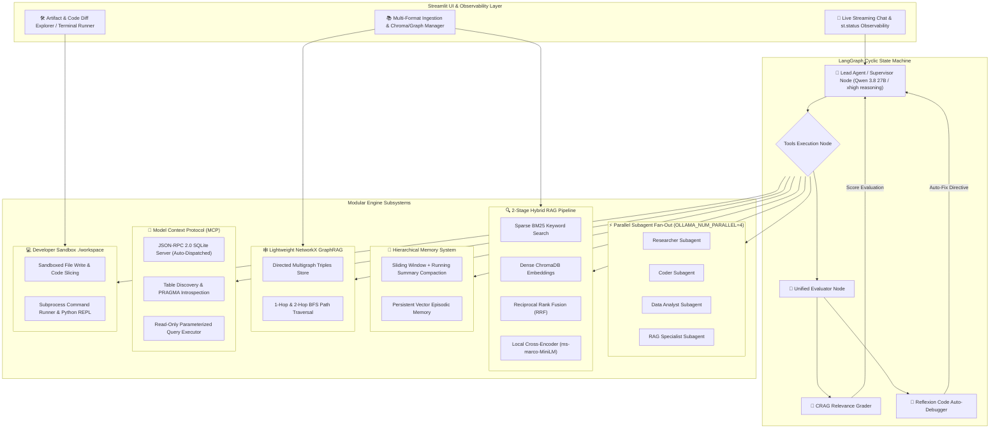

# 🤖 Local Agentic RAG: Enterprise-Grade, 100% Free AI Agent Stack

[](https://www.python.org/)
[](https://github.com/langchain-ai/langgraph)
[-black.svg)](https://ollama.ai/)
[](https://www.trychroma.com/)
[](https://networkx.org/)
[-purple.svg)](https://modelcontextprotocol.io/)
[](https://streamlit.io/)
[-brightgreen.svg)]()

An enterprise-grade, production-ready **Local Agentic AI Assistant** featuring cyclic graph orchestration, dual-stage Hybrid RAG with Cross-Encoder reranking, official Model Context Protocol (MCP) SQLite introspection, Reflexion self-healing auto-debugging, multi-slot parallel subagent fan-out, persistent episodic memory, in-memory GraphRAG, and an interactive Streamlit workbench—**all completely 100% free to run without credit cards**!

---

## 📑 Table of Contents
- [Architecture Overview](#-architecture-overview)
- [Key Features](#-key-features)
- [Repository Structure](#-repository-structure)
- [Quickstart Guide](#-quickstart-guide)
- [Agent Tool Ecosystem](#-agent-tool-ecosystem)
- [License](#-license)

---

## 🏛️ Architecture Overview



---

## 🌟 Key Features

### 1. ⚡ Parallel Subagent Fan-Out / Fan-In (`OLLAMA_NUM_PARALLEL=4`)
- Exploits Ollama's multi-slot GPU concurrency to dispatch up to 4 specialized subagents (`researcher`, `coder`, `data_analyst`, `rag_specialist`, `custom`) simultaneously.
- Cuts multi-agent pipeline latency down to $\max(T_1, T_2, T_3, T_4)$ and aggregates structured findings back to the Lead Agent.

### 2. 🔍 2-Stage Hybrid Search (BM25 + Dense RRF) & Local Cross-Encoder Reranker
- **Stage 1 (Recall)**: Dual-stream sparse exact keyword matching (Okapi BM25) and dense semantic vector embeddings (`all-MiniLM-L6-v2`) fused using Reciprocal Rank Fusion ($RRF = \sum \frac{1}{60 + \text{rank}}$).
- **Stage 2 (Precision)**: Local Cross-Encoder (`cross-encoder/ms-marco-MiniLM-L-6-v2`) cross-attention scoring on CPU (<40ms) to eliminate semantic noise.

### 3. 🎯 Self-RAG / Corrective RAG (CRAG) Grader Node
- Evaluates retrieved document confidence in the LangGraph loop.
- Automatically tags high-confidence matches or injects corrective guidance to route to live web search (`DuckDuckGo` + `read_webpage`) to prevent hallucinations.

### 4. 🔧 Self-Correcting Code Auto-Debugger Loop (Reflexion)
- Intercepts runtime errors (`ZeroDivisionError`, `SyntaxError`, `NameError`, non-zero terminal exit codes) from sandbox executions.
- Injects a structured **Reflexion Diagnostic Directive** prompting the agent to inspect the source line via `view_code_slice`, apply patches via `write_local_file`, and re-test until clean execution is achieved.

### 5. 🔌 Real Model Context Protocol (MCP) Server with SQLite Introspection
- Standard **JSON-RPC 2.0 protocol** server with zero-port auto-dispatch (no manual `uvicorn` processes needed).
- Dynamic schema discovery: `mcp_list_tables`, `mcp_describe_table`, and `mcp_execute_query` with strict safety guards blocking destructive operations.

### 6. 🕸️ Lightweight NetworkX GraphRAG Triples Extractor
- Pure-Python in-memory and persistent knowledge graph (`data/knowledge_graph.json`).
- Automated regex/NLP triple extractor parsing entity-relationship tuples from ingested text.
- 1-hop neighbor inspection and 2-hop BFS multi-hop path traversal (`query_knowledge_graph`).

### 7. 🧠 Hierarchical Memory & Sliding-Window Context Compaction
- **Sliding-Window Compactor**: Automatically preserves recent dialogue turns while compressing older context into a structured bulleted summary, preventing token budget blowups.
- **Persistent Episodic Memory**: Dedicated ChromaDB vector collection (`episodic_chat_memory`) with `store_episodic_memory` and `recall_past_memory` to remember user preferences across sessions.

### 8. 🛠️ Interactive Artifact & Code Diff Workbench in Streamlit
- **Code Viewer**: Syntax-highlighted code explorer for `.py`, `.sql`, `.json`, `.csv`, `.md`, `.js`, `.bash` files in `./workspace`.
- **Visual Code Diff Explorer**: Side-by-side and unified git-style colorized diff viewer comparing sandbox files.
- **Terminal Runner & In-Browser Editor**: Direct script execution and file editing inside the Streamlit interface.

### 9. 🌊 Real-Time Token-by-Token Streaming & Live Observability
- Built on LangGraph `stream_mode="messages"` delivering real-time typewriter token generation with an animated cursor alongside interactive `st.status` reasoning traces.

### 10. 💬 Persistent Chat Sessions + Markdown Export
- SQLite-backed local session store (`data/chat_sessions.db`) — chat survives refresh/restart.
- Create, switch, rename, delete sessions in the sidebar; first user message auto-titles the session.
- One-click **Export Session as Markdown** download with tool traces and citations.

### 11. 📎 Clickable Citations & Source Panel
- Hybrid RAG answers record structured citations (source, score, preview, **resolved path**).
- Streamlit shows a **Sources & Citations** panel with Open source (matched snippet + file preview) and Download.
- `/search` and `/sources` API endpoints return path-resolved citations for external clients.

### 12. 🌐 Free Local REST API (FastAPI) + SSE Streaming
- `GET  /health` — model endpoint status
- `POST /chat` — session-aware multi-turn agent turn + citations
- `POST /chat/stream` — **Server-Sent Events** stream (`meta` / `token` / `tool_call` / `tool_result` / `grade` / `done` / `error`)
- `POST /search` — hybrid RAG only (no LLM), path-resolved citations
- `POST /ingest` — push text into Chroma (also saves a copy under `data/`)
- `GET  /sessions`, `GET /sessions/{id}/export`, `GET /sources?name=...`
- Launch: `uvicorn src.api.server:app --host 127.0.0.1 --port 8000`

### 13. 🧠 Session-Aware Multi-Turn Context
- Shared `src/memory/session_context.py` + `src/agent/runner.py` used by both UI and API.
- Within-session history is rebuilt each turn; other sessions + episodic memories are injected as a brief system note.
- Citations and tool steps persist with each assistant turn.

### 14. 📊 Offline RAG Evaluation Harness
- Hit Rate@k, MRR, and keyword coverage on a local JSON eval set (`data/eval_set.json`).
- Run: `python -m src.eval.rag_eval` or `python -m src.eval.rag_eval --json`
- No paid APIs — pure local retrieval metrics for tuning.

### 15. 📈 CSV / Tabular Data Tools
- Agent tools: `list_data_files`, `analyze_csv_summary`, `csv_query`, `csv_groupby`, `save_csv_chart`.
- pandas + matplotlib only; sample data in `data/sample_sales.csv`.

### 16. 🧭 Git Workspace Tools
- Agent tools: `git_status`, `git_log`, `git_diff`, `git_workspace_status`.
- Inspect project changes without leaving the chat.

### 17. 🔁 BM25 Index Freshness
- In-process BM25 cache auto-invalidates after upload / re-index / wipe / API ingest.
- Stale detection compares Chroma chunk count vs the BM25 build snapshot.
- Sidebar **Rebuild BM25 Index** button + `POST /reindex/bm25`.

### 18. 🪟 Windows-Safe Sandbox Shell
- `execute_terminal_command` runs under **PowerShell** on Windows and **bash** on POSIX.
- Uses explicit argv (no `shell=True`), UTF-8 I/O, and real exit codes for Reflexion.
- UI default commands match the platform (`Get-Content` vs `cat`).

### 19. 🩺 Live LLM Endpoint Health
- `src/agent/health.py` pings the OpenAI-compatible `/v1/models` (with Ollama `/api/tags` fallback).
- Sidebar shows ONLINE/OFFLINE + latency (cached ~30s) with a manual ↻ re-check.
- `/health` returns `llm` and `bm25` status; chat warns before a turn if the endpoint is down.

### 20. ⚡ Live Parallel Subagent Visibility
- `spawn_parallel_subagents` publishes `subagent_start` / `subagent_done` / `subagents_all_done` through a thread-safe observer bus.
- The agent runner runs the graph on a worker thread so those events interleave live with tokens/tools.
- Streamlit status panel and SSE clients see each fan-out agent as it starts and finishes.

### 21. ✨ Auto Episodic Memory Capture
- Heuristics (`src/memory/auto_memory.py`) detect phrases like “I prefer…”, “always…”, “remember that…”.
- Facts are stored with category + session_id; near-duplicates are skipped.
- Sidebar toggle; API `auto_memory` flag + `memory_capture` SSE event / response field.

### 22. 🔎 Cross-Session Chat Search
- `chat_sessions.search_messages()` does case-insensitive substring search across all sessions.
- Sidebar “Search all sessions” expander with Open-session jump buttons.
- `GET /sessions/search?q=...` for API clients.

### 23. 🕸️ GraphRAG Fusion in Hybrid Search & Citations
- KG subgraph hits become real Documents (`metadata.kind='graphrag'`) with paths to `data/knowledge_graph.json`.
- Fused with dense + BM25 via the same RRF, then cross-encoder reranked.
- Citation panel shows GraphRAG sources with entity previews; `query_knowledge_graph` also records citations.

### 24. 🌐 URL → Knowledge Base Ingest
- `ingest_webpage` tool + `POST /ingest/url` + sidebar “Ingest URL” expander.
- Scrapes page → saves under `data/` → chunks into Chroma → extracts GraphRAG triples → invalidates BM25.

### 25. 🧬 Auto-Generated RAG Eval Set
- `src/eval/auto_eval_set.py` derives cases from headings / sentences / keywords in `data/` files.
- Merge-safe with hand-written cases; CLI: `python -m src.eval.rag_eval --generate` or `--generate-only`.
- Sidebar buttons to generate cases and run Hit@3 / MRR.
---

## 📁 Repository Structure

```text
local-agentic-rag/
├── data/
│   ├── chroma_db/             # Persistent document vectorstore
│   ├── chroma_memory/         # Persistent episodic memory vectorstore
│   └── knowledge_graph.json   # Persistent NetworkX GraphRAG triples
├── notebooks/
│   └── lm-server.ipynb        # Free Kaggle/Colab GPU server with Ollama & ngrok
├── src/
│   ├── agent/
│   │   ├── graph.py           # Master LangGraph state machine & Lead Agent
│   │   ├── health.py          # Local LLM endpoint health probe
│   │   ├── runner.py          # Shared event-stream runner (UI + API + SSE)
│   │   ├── subagent_events.py # Thread-safe parallel-subagent progress bus
│   │   └── subagents.py       # Parallel subagent factory & dispatch engine
│   ├── api/
│   │   └── server.py          # Free local FastAPI REST API + SSE
│   ├── eval/
│   │   ├── auto_eval_set.py   # Auto-generate eval cases from data/
│   │   └── rag_eval.py        # Offline Hit@k / MRR evaluation harness
│   ├── memory/
│   │   ├── auto_memory.py     # Heuristic preference capture → episodic store
│   │   ├── chat_sessions.py   # SQLite chat session persistence + search/export
│   │   ├── session_context.py # Multi-turn + cross-session context builder
│   │   └── episodic_memory.py # Vector memory & sliding-window context compactor
│   ├── mcp_server/
│   │   ├── sqlite_server.py   # Official JSON-RPC 2.0 MCP SQLite server
│   │   └── mock_data.db       # Relational SQLite database
│   ├── rag/
│   │   ├── vectorstore.py     # ChromaDB multi-format document indexer
│   │   ├── hybrid_search.py   # BM25 + Dense + GraphRAG Reciprocal Rank Fusion
│   │   ├── ingest_url.py      # Webpage → data/ + Chroma + GraphRAG ingest
│   │   ├── reranker.py        # Sentence-transformers Cross-Encoder
│   │   ├── citations.py       # In-process RAG citation store
│   │   └── graph_rag.py       # NetworkX GraphRAG knowledge graph engine
│   └── tools/
│       ├── coding_tools.py    # Sandboxed terminal, file I/O, tree, grep, slice
│       ├── data_tools.py      # CSV/Excel pandas analysis & chart tools
│       ├── git_tools.py       # Local git status/log/diff tools
│       ├── graph_tool.py      # Knowledge graph multi-hop query tool
│       ├── mcp_tool.py        # MCP client tools (tables, describe, query)
│       ├── rag_tool.py        # 2-stage hybrid search tool
│       └── web_scraper.py     # DuckDuckGo web search & HTML scraper
├── ui/
│   ├── app.py                 # Streamlit chat & interactive workbench UI
│   └── citation_view.py       # Clickable citation open/preview/download panel
├── workspace/                 # Sandboxed environment for agent-generated code
├── data/
│   ├── eval_set.json          # Offline RAG evaluation cases
│   └── sample_sales.csv       # Sample tabular data for data tools
├── requirements.txt           # Project dependencies
└── README.md                  # Project documentation
```

---

## 🚀 Quickstart Guide

### 1. Start the Remote LLM Backend ($0 Free GPU)
1. Open [`notebooks/lm-server.ipynb`](notebooks/lm-server.ipynb) on a free **Kaggle** (2x T4 GPUs) or **Google Colab** instance.
2. Add your ngrok token to the notebook secrets (`NGROK_AUTHTOKEN`).
3. Run all cells. The notebook starts Ollama with `OLLAMA_NUM_PARALLEL=4` and outputs a public URL:
   ```text
   Public ngrok endpoint: https://xxxx-xx-xxx.ngrok-free.app/v1
   ```

### 2. Setup Local Environment
Clone the repository and install the dependencies:
```bash
git clone https://github.com/iqzaardiansyah/local-agentic-rag.git
cd local-agentic-rag

python -m venv venv
# On Windows:
venv\Scripts\activate
# On Linux / macOS:
# source venv/bin/activate

pip install -r requirements.txt
```

### 3. Configure `.env`
Create a `.env` file in the root directory:
```env
LLM_BASE_URL=https://xxxx-xx-xxx.ngrok-free.app/v1
LLM_MODEL=qwen3.8:27b
LLM_API_KEY=ollama
```

### 4. Launch the Streamlit Application
```bash
streamlit run ui/app.py
```
Open `http://localhost:8501` in your browser!

---

## 🧰 Agent Tool Ecosystem

| Tool Name | Category | Description |
| :--- | :--- | :--- |
| **`spawn_parallel_subagents`** | Orchestration | Concurrently runs up to 4 specialized subagents across parallel Ollama GPU slots. |
| **`search_local_documents`** | Hybrid RAG | 2-stage hybrid retrieval (BM25 + Chroma Dense + GraphRAG via RRF) with Cross-Encoder reranking. |
| **`query_knowledge_graph`** | GraphRAG | Traverses NetworkX knowledge graph for 1-hop and 2-hop relational paths. |
| **`ingest_webpage`** | Ingest | Scrape a URL into data/ + Chroma + GraphRAG and make it searchable. |
| **`recall_past_memory`** | Memory | Semantically recalls user preferences and project rules from persistent vector memory. |
| **`store_episodic_memory`** | Memory | Permanently saves facts and architectural decisions to long-term memory. |
| **`mcp_list_tables`** | MCP Database | Discovers all SQLite tables and record counts via MCP JSON-RPC 2.0. |
| **`mcp_describe_table`** | MCP Database | Introspects table schema, column data types, primary keys, and foreign keys. |
| **`mcp_execute_query`** | MCP Database | Executes parameterized read-only SQL queries with safety validation. |
| **`execute_python_code`** | Coding | Sandboxed Python REPL for mathematical calculations and data transformations. |
| **`execute_terminal_command`** | Coding | Runs bash/shell commands, tests, and scripts inside `./workspace`. |
| **`read_local_file`** | File I/O | Reads file contents safely within the `./workspace` sandbox. |
| **`write_local_file`** | File I/O | Creates or overwrites code files inside `./workspace`. |
| **`list_directory_tree`** | Codebase | Recursively prints directory tree structures with size metrics. |
| **`grep_search`** | Codebase | Regex/pattern search across codebase files with line numbers. |
| **`view_code_slice`** | Codebase | Reads precise line number ranges without dumping entire files. |
| **`find_files_by_pattern`** | Codebase | Glob pattern search (e.g. `*.py`, `*.json`) across project directories. |
| **`web_search`** | Web | Live internet search via DuckDuckGo. |
| **`read_webpage`** | Web | Scrapes and converts live webpage HTML into clean readable markdown. |
| **`list_data_files`** | Data | Lists CSV/Excel/JSON data files in `data/` and `workspace/`. |
| **`analyze_csv_summary`** | Data | Shape, dtypes, nulls, describe stats, and preview for a CSV. |
| **`csv_query`** | Data | Pandas expression eval against a CSV (`df` is available). |
| **`csv_groupby`** | Data | Group-by aggregation (mean/sum/count/min/max/median/std). |
| **`save_csv_chart`** | Data | Renders line/bar/scatter/hist charts into `workspace/`. |
| **`git_status`** | Git | Project git status (branch + changes). |
| **`git_log`** | Git | Recent commit history. |
| **`git_diff`** | Git | Unified git diff (optionally staged / path-filtered). |
| **`git_workspace_status`** | Git | Git status of `./workspace` if it is a repo. |

---

## 🌐 Free Local REST API

```bash
uvicorn src.api.server:app --host 127.0.0.1 --port 8000
```

```bash
curl http://127.0.0.1:8000/health
curl -X POST http://127.0.0.1:8000/search -H "Content-Type: application/json" -d '{"query":"hybrid search","top_k":3}'
curl -X POST http://127.0.0.1:8000/chat -H "Content-Type: application/json" -d '{"message":"Summarize the local knowledge base","session_id":"demo-1"}'
curl -N -X POST http://127.0.0.1:8000/chat/stream -H "Content-Type: application/json" -d '{"message":"List data files","session_id":"demo-1"}'
curl -X POST http://127.0.0.1:8000/reindex/bm25
curl "http://127.0.0.1:8000/sources?name=README.md"
curl "http://127.0.0.1:8000/sessions/search?q=hybrid"
```

SSE events on `/chat/stream`: `meta`, `token`, `tool_call`, `tool_result`, `grade`, `subagent_start`, `subagent_done`, `subagents_all_done`, `memory_capture`, `done`, `error`.

When `session_id` is set on `/chat` or `/chat/stream`, prior turns in that session are used as multi-turn context and the exchange is persisted (with citations).

## 📊 Offline RAG Eval

```bash
python -m src.eval.rag_eval
python -m src.eval.rag_eval --top-k 5 --json
python -m src.eval.auto_eval_set          # generate/merge cases from data/
python -m src.eval.rag_eval --generate    # generate then evaluate
```

Add cases to `data/eval_set.json` as `{"query", "expected_source_substring", "answer_keywords"}`, or let `--generate` derive them from files in `data/`.

---

## 📜 License
Distributed under the MIT License. Built with ❤️ by [iqzaardiansyah](https://github.com/iqzaardiansyah).
