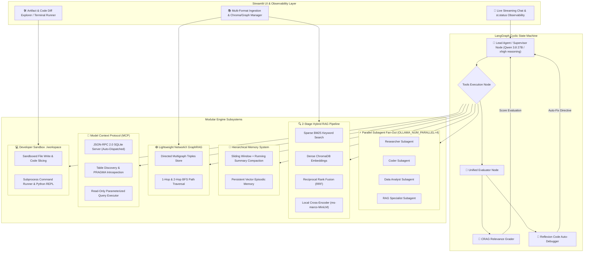

# 🤖 Local Agentic RAG: Enterprise-Grade, 100% Free AI Agent Stack

[](https://www.python.org/)
[](https://github.com/langchain-ai/langgraph)
[-black.svg)](https://ollama.ai/)
[](https://www.trychroma.com/)
[](https://networkx.org/)
[-purple.svg)](https://modelcontextprotocol.io/)
[](https://streamlit.io/)
[-brightgreen.svg)]()

An enterprise-grade, production-ready **Local Agentic AI Assistant** featuring cyclic graph orchestration, dual-stage Hybrid RAG with Cross-Encoder reranking, official Model Context Protocol (MCP) SQLite introspection, Reflexion self-healing auto-debugging, multi-slot parallel subagent fan-out, persistent episodic memory, in-memory GraphRAG, and an interactive Streamlit workbench—**all completely 100% free to run without credit cards**!

---

## 📑 Table of Contents
- [Architecture Overview](#-architecture-overview)
- [Key Features](#-key-features)
- [Repository Structure](#-repository-structure)
- [Quickstart Guide](#-quickstart-guide)
- [Agent Tool Ecosystem](#-agent-tool-ecosystem)
- [License](#-license)

---

## 🏛️ Architecture Overview



---

## 🌟 Key Features

### 1. ⚡ Parallel Subagent Fan-Out / Fan-In (`OLLAMA_NUM_PARALLEL=4`)
- Exploits Ollama's multi-slot GPU concurrency to dispatch up to 4 specialized subagents (`researcher`, `coder`, `data_analyst`, `rag_specialist`, `custom`) simultaneously.
- Cuts multi-agent pipeline latency down to $\max(T_1, T_2, T_3, T_4)$ and aggregates structured findings back to the Lead Agent.

### 2. 🔍 2-Stage Hybrid Search (BM25 + Dense RRF) & Local Cross-Encoder Reranker
- **Stage 1 (Recall)**: Dual-stream sparse exact keyword matching (Okapi BM25) and dense semantic vector embeddings (`all-MiniLM-L6-v2`) fused using Reciprocal Rank Fusion ($RRF = \sum rac{1}{60 + 	ext{rank}}$).
- **Stage 2 (Precision)**: Local Cross-Encoder (`cross-encoder/ms-marco-MiniLM-L-6-v2`) cross-attention scoring on CPU (<40ms) to eliminate semantic noise.

### 3. 🎯 Self-RAG / Corrective RAG (CRAG) Grader Node
- Evaluates retrieved document confidence in the LangGraph loop.
- Automatically tags high-confidence matches or injects corrective guidance to route to live web search (`DuckDuckGo` + `read_webpage`) to prevent hallucinations.

### 4. 🔧 Self-Correcting Code Auto-Debugger Loop (Reflexion)
- Intercepts runtime errors (`ZeroDivisionError`, `SyntaxError`, `NameError`, non-zero terminal exit codes) from sandbox executions.
- Injects a structured **Reflexion Diagnostic Directive** prompting the agent to inspect the source line via `view_code_slice`, apply patches via `write_local_file`, and re-test until clean execution is achieved.

### 5. 🔌 Real Model Context Protocol (MCP) Server with SQLite Introspection
- Standard **JSON-RPC 2.0 protocol** server with zero-port auto-dispatch (no manual `uvicorn` processes needed).
- Dynamic schema discovery: `mcp_list_tables`, `mcp_describe_table`, and `mcp_execute_query` with strict safety guards blocking destructive operations.

### 6. 🕸️ Lightweight NetworkX GraphRAG Triples Extractor
- Pure-Python in-memory and persistent knowledge graph (`data/knowledge_graph.json`).
- Automated regex/NLP triple extractor parsing entity-relationship tuples from ingested text.
- 1-hop neighbor inspection and 2-hop BFS multi-hop path traversal (`query_knowledge_graph`).

### 7. 🧠 Hierarchical Memory & Sliding-Window Context Compaction
- **Sliding-Window Compactor**: Automatically preserves recent dialogue turns while compressing older context into a structured bulleted summary, preventing token budget blowups.
- **Persistent Episodic Memory**: Dedicated ChromaDB vector collection (`episodic_chat_memory`) with `store_episodic_memory` and `recall_past_memory` to remember user preferences across sessions.

### 8. 🛠️ Interactive Artifact & Code Diff Workbench in Streamlit
- **Code Viewer**: Syntax-highlighted code explorer for `.py`, `.sql`, `.json`, `.csv`, `.md`, `.js`, `.bash` files in `./workspace`.
- **Visual Code Diff Explorer**: Side-by-side and unified git-style colorized diff viewer comparing sandbox files.
- **Terminal Runner & In-Browser Editor**: Direct script execution and file editing inside the Streamlit interface.

### 9. 🌊 Real-Time Token-by-Token Streaming & Live Observability
- Built on LangGraph `stream_mode="messages"` delivering real-time typewriter token generation with an animated cursor alongside interactive `st.status` reasoning traces.

---

## 📁 Repository Structure

```text
local-agentic-rag/
├── data/
│   ├── chroma_db/             # Persistent document vectorstore
│   ├── chroma_memory/         # Persistent episodic memory vectorstore
│   └── knowledge_graph.json   # Persistent NetworkX GraphRAG triples
├── notebooks/
│   └── lm-server.ipynb        # Free Kaggle/Colab GPU server with Ollama & ngrok
├── src/
│   ├── agent/
│   │   ├── graph.py           # Master LangGraph state machine & Lead Agent
│   │   └── subagents.py       # Parallel subagent factory & dispatch engine
│   ├── memory/
│   │   └── episodic_memory.py # Vector memory & sliding-window context compactor
│   ├── mcp_server/
│   │   ├── sqlite_server.py   # Official JSON-RPC 2.0 MCP SQLite server
│   │   └── mock_data.db       # Relational SQLite database
│   ├── rag/
│   │   ├── vectorstore.py     # ChromaDB multi-format document indexer
│   │   ├── hybrid_search.py   # BM25 + Dense Reciprocal Rank Fusion
│   │   ├── reranker.py        # Sentence-transformers Cross-Encoder
│   │   └── graph_rag.py       # NetworkX GraphRAG knowledge graph engine
│   └── tools/
│       ├── coding_tools.py    # Sandboxed terminal, file I/O, tree, grep, slice
│       ├── graph_tool.py      # Knowledge graph multi-hop query tool
│       ├── mcp_tool.py        # MCP client tools (tables, describe, query)
│       ├── rag_tool.py        # 2-stage hybrid search tool
│       └── web_scraper.py     # DuckDuckGo web search & HTML scraper
├── ui/
│   └── app.py                 # Streamlit chat & interactive workbench UI
├── workspace/                 # Sandboxed environment for agent-generated code
├── requirements.txt           # Project dependencies
└── README.md                  # Project documentation
```

---

## 🚀 Quickstart Guide

### 1. Start the Remote LLM Backend ($0 Free GPU)
1. Open [`notebooks/lm-server.ipynb`](notebooks/lm-server.ipynb) on a free **Kaggle** (2x T4 GPUs) or **Google Colab** instance.
2. Add your ngrok token to the notebook secrets (`NGROK_AUTHTOKEN`).
3. Run all cells. The notebook starts Ollama with `OLLAMA_NUM_PARALLEL=4` and outputs a public URL:
   ```text
   Public ngrok endpoint: https://xxxx-xx-xxx.ngrok-free.app/v1
   ```

### 2. Setup Local Environment
Clone the repository and install the dependencies:
```bash
git clone https://github.com/iqzaardiansyah/local-agentic-rag.git
cd local-agentic-rag

python -m venv venv
# On Windows:
venv\Scripts\activate
# On Linux / macOS:
# source venv/bin/activate

pip install -r requirements.txt
```

### 3. Configure `.env`
Create a `.env` file in the root directory:
```env
LLM_BASE_URL=https://xxxx-xx-xxx.ngrok-free.app/v1
LLM_MODEL=qwen3.8:27b
LLM_API_KEY=ollama
```

### 4. Launch the Streamlit Application
```bash
streamlit run ui/app.py
```
Open `http://localhost:8501` in your browser!

---

## 🧰 Agent Tool Ecosystem

| Tool Name | Category | Description |
| :--- | :--- | :--- |
| **`spawn_parallel_subagents`** | Orchestration | Concurrently runs up to 4 specialized subagents across parallel Ollama GPU slots. |
| **`search_local_documents`** | Hybrid RAG | 2-stage hybrid retrieval (BM25 + Chroma Dense via RRF) with Cross-Encoder reranking. |
| **`query_knowledge_graph`** | GraphRAG | Traverses NetworkX knowledge graph for 1-hop and 2-hop relational paths. |
| **`recall_past_memory`** | Memory | Semantically recalls user preferences and project rules from persistent vector memory. |
| **`store_episodic_memory`** | Memory | Permanently saves facts and architectural decisions to long-term memory. |
| **`mcp_list_tables`** | MCP Database | Discovers all SQLite tables and record counts via MCP JSON-RPC 2.0. |
| **`mcp_describe_table`** | MCP Database | Introspects table schema, column data types, primary keys, and foreign keys. |
| **`mcp_execute_query`** | MCP Database | Executes parameterized read-only SQL queries with safety validation. |
| **`execute_python_code`** | Coding | Sandboxed Python REPL for mathematical calculations and data transformations. |
| **`execute_terminal_command`** | Coding | Runs bash/shell commands, tests, and scripts inside `./workspace`. |
| **`read_local_file`** | File I/O | Reads file contents safely within the `./workspace` sandbox. |
| **`write_local_file`** | File I/O | Creates or overwrites code files inside `./workspace`. |
| **`list_directory_tree`** | Codebase | Recursively prints directory tree structures with size metrics. |
| **`grep_search`** | Codebase | Regex/pattern search across codebase files with line numbers. |
| **`view_code_slice`** | Codebase | Reads precise line number ranges without dumping entire files. |
| **`find_files_by_pattern`** | Codebase | Glob pattern search (e.g. `*.py`, `*.json`) across project directories. |
| **`web_search`** | Web | Live internet search via DuckDuckGo. |
| **`read_webpage`** | Web | Scrapes and converts live webpage HTML into clean readable markdown. |

---

## 📜 License
Distributed under the MIT License. Built with ❤️ by [iqzaardiansyah](https://github.com/iqzaardiansyah).
