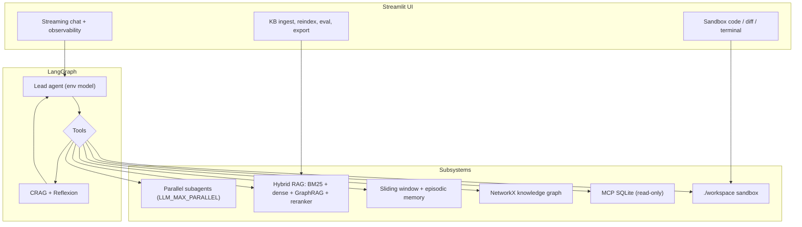

# Local Agentic RAG

[](https://www.python.org/)
[](https://github.com/langchain-ai/langgraph)
[-black.svg)]()
[](https://www.trychroma.com/)
[](https://networkx.org/)
[](https://streamlit.io/)
[]()

Local agentic assistant: LangGraph tool loop, hybrid RAG + GraphRAG, MCP SQLite, sandbox coding tools, Streamlit UI, FastAPI + SSE. Models are configured in `.env` (Ollama, llama.cpp, vLLM, K2 Horizon, etc.).

---

## Table of contents

- [Architecture](#architecture)
- [LLM configuration](#llm-configuration)
- [Key features](#key-features)
- [Repository structure](#repository-structure)
- [Quickstart](#quickstart)
- [Agent tools](#agent-tools)
- [REST API](#rest-api)
- [Offline RAG eval](#offline-rag-eval)
- [License](#license)

---

## Architecture



---

## LLM configuration

All model knobs live in `.env` (see `.env.example`). They are loaded by `src/agent/llm_config.py`.

```env
LLM_BASE_URL=http://localhost:11434/v1
LLM_MODEL=qwen3.6:latest
LLM_API_KEY=ollama

LLM_TEMPERATURE=0.7
LLM_TOP_P=1.0
LLM_MAX_TOKENS=4096

LLM_ENABLE_THINKING=false
LLM_THINKING_BUDGET=4096

# Concurrency for parallel subagents (not hardcoded).
# If unset: probe server, else default 4.
LLM_MAX_PARALLEL=4
```

### Backends

| Backend | Typical `LLM_BASE_URL` | Notes |
|--------|-------------------------|--------|
| Ollama | `http://localhost:11434/v1` | Set `OLLAMA_NUM_PARALLEL` on the **server** to match `LLM_MAX_PARALLEL`. |
| llama.cpp | `http://localhost:8080/v1` | Slots/ctx come from server flags (`-np`, `--ctx-size`). |
| vLLM | `http://localhost:8000/v1` | Use `--max-num-seqs` / `--max-model-len`; set `LLM_MAX_PARALLEL` to match. |

Notebooks:

| Notebook | Purpose |
|----------|---------|
| `notebooks/lm-server.ipynb` | Ollama + ngrok (Kaggle) |
| `notebooks/lm-server-llama-cpp.ipynb` | llama.cpp CUDA server |
| `notebooks/lm-server-vllm.ipynb` | vLLM (e.g. K2 Horizon AWQ) |
| `notebooks/build-publish-k2-llama-cpp.ipynb` | Build/publish K2Horizon llama.cpp fork |

### K2 Horizon

If `LLM_MODEL` contains `K2-Horizon`, the client auto-applies IFM-style defaults:

- `reasoning_effort` via `LLM_REASONING_EFFORT` (default `high`)
- `tool_call_format` via `LLM_TOOL_CALL_FORMAT` (`json` \| `xml` \| `xml_typed`; default `xml`)
- Temperature `1.0`, `top_p` `0.95` unless overridden

On vLLM, use a matching parser (e.g. `--tool-call-parser k2_horizon`). The tool format must match that parser.

### Parallelism

`spawn_parallel_subagents` caps fan-out at `get_max_parallel()`:

1. `LLM_MAX_PARALLEL` env  
2. Server probe (`total_slots` / `n_parallel` / `max_num_seqs`)  
3. Default `4`

Change server capacity → update `LLM_MAX_PARALLEL` in `.env` (do not assume 4).

---

## Key features

### Agent runtime
- LangGraph lead agent + tool node + CRAG/Reflexion evaluator
- Shared runner for UI and API: tokens, tool calls, subagent events, metrics
- Session history + optional cross-session / episodic context
- Fork session, regenerate last reply, pin sessions, search all sessions
- Auto-capture of preference phrases into episodic memory

### Retrieval
- Hybrid search: BM25 + Chroma dense + GraphRAG documents → RRF → cross-encoder
- Citations with on-disk path, preview, download (DBs/binary skipped)
- URL ingest → `data/` + Chroma + GraphRAG + BM25 invalidate
- `data/` fingerprint watch + reindex; KB Markdown export
- Offline eval: Hit@k, MRR (`python -m src.eval.rag_eval`)

### Tools
- Coding sandbox: files, terminal (PowerShell on Windows / bash on POSIX), Python REPL
- Codebase: tree, grep, slice, glob
- Data: AST-safe CSV query/groupby/charts
- Git status/log/diff
- MCP SQLite introspection (read-only)
- Web search (local TTL cache) + page scrape

### UI & API
- Streamlit chat, citations, workbench, health check, auto-scroll
- FastAPI + SSE (`/chat/stream`)
- Session persist/export, research brief, KB export
- Config validation for `.env`

---

## Repository structure

```text
local-agentic-rag/
├── data/                      # KB sources, eval set, runtime DBs
├── notebooks/                 # Ollama / llama.cpp / vLLM / K2 build notebooks
├── src/
│   ├── agent/
│   │   ├── config.py          # .env validation
│   │   ├── graph.py           # LangGraph lead agent
│   │   ├── health.py          # LLM endpoint probe
│   │   ├── llm_config.py      # Env-driven model settings
│   │   ├── metrics.py         # Turn metrics
│   │   ├── runner.py          # UI/API event runner
│   │   ├── subagent_events.py # Subagent progress bus
│   │   └── subagents.py       # Parallel subagents
│   ├── api/server.py          # FastAPI + SSE
│   ├── eval/                  # Offline RAG eval + auto case gen
│   ├── memory/                # Sessions, context, episodic, briefs
│   ├── mcp_server/            # SQLite MCP
│   ├── rag/                   # Vectorstore, hybrid search, GraphRAG, export
│   └── tools/                 # Coding, data, git, RAG, web tools
├── ui/
│   ├── app.py                 # Streamlit app
│   └── citation_view.py
├── workspace/                 # Agent sandbox (gitignored)
├── .streamlit/config.toml
├── .env.example
└── requirements.txt
```

---

## Quickstart

### 1. LLM backend

Pick one notebook (or local Ollama) and note the `/v1` URL. Set server concurrency (Ollama `OLLAMA_NUM_PARALLEL`, llama.cpp `-np`, vLLM `--max-num-seqs`) and keep `LLM_MAX_PARALLEL` in `.env` in sync.

### 2. Install

```bash
git clone https://github.com/iqzaardiansyah/local-agentic-rag.git
cd local-agentic-rag
python -m venv venv
# Windows: venv\Scripts\activate
# Unix: source venv/bin/activate
pip install -r requirements.txt
```

### 3. `.env`

```env
LLM_BASE_URL=https://your-endpoint/v1
LLM_MODEL=qwen3.8:27b
LLM_API_KEY=ollama
LLM_MAX_PARALLEL=4
```

Copy `.env.example` for the full list (sampling, thinking, K2, timeouts).

### 4. Run UI

```bash
streamlit run ui/app.py
```

Open `http://localhost:8501`.

Optional API:

```bash
uvicorn src.api.server:app --host 127.0.0.1 --port 8000
```

---

## Agent tools

| Tool | Category | Description |
|------|----------|-------------|
| `spawn_parallel_subagents` | Orchestration | Fan-out subagents (capped by `LLM_MAX_PARALLEL`). |
| `search_local_documents` | Hybrid RAG | BM25 + dense + GraphRAG + reranker + citations. |
| `query_knowledge_graph` | GraphRAG | 1-hop / 2-hop knowledge graph paths. |
| `ingest_webpage` | Ingest | URL → `data/` + Chroma + GraphRAG. |
| `recall_past_memory` / `store_episodic_memory` | Memory | Episodic vector memory. |
| `mcp_list_tables` / `mcp_describe_table` / `mcp_execute_query` | MCP | SQLite introspection (read-only). |
| `execute_python_code` | Coding | Sandbox Python. |
| `execute_terminal_command` | Coding | PowerShell (Windows) / bash (POSIX) in `./workspace`. |
| `read_local_file` / `write_local_file` | File I/O | Sandbox files. |
| `list_directory_tree` / `grep_search` / `view_code_slice` / `find_files_by_pattern` | Codebase | Inspect project/sandbox. |
| `web_search` / `read_webpage` | Web | DuckDuckGo + scrape (cached). |
| `list_data_files` / `analyze_csv_summary` / `csv_query` / `csv_groupby` / `save_csv_chart` | Data | Safe CSV/Excel analysis. |
| `git_status` / `git_log` / `git_diff` / `git_workspace_status` | Git | Repo status. |

---

## REST API

```bash
uvicorn src.api.server:app --host 127.0.0.1 --port 8000
```

| Endpoint | Purpose |
|----------|---------|
| `GET /health` | LLM + BM25 health |
| `POST /chat` | Full agent turn + citations + metrics |
| `POST /chat/stream` | SSE: `meta`, `token`, `tool_call`, `tool_result`, `grade`, `subagent_*`, `memory_capture`, `done`, `error` |
| `POST /search` | Hybrid RAG only |
| `POST /ingest` / `POST /ingest/url` | Index text or URL |
| `GET/DELETE /cache/websearch` | Web cache |
| `GET /kb/watch` / `POST /kb/reindex` | data/ freshness |
| `POST /kb/export` | KB Markdown export |
| `GET /config/validate` | `.env` check |
| `GET /sessions` / `GET /sessions/search` | Sessions + search |
| `POST /sessions/{id}/brief` | Research brief |
| `POST /sessions/{id}/pin` | Pin session |
| `GET /sources?name=` | Resolve citation file |

```bash
curl http://127.0.0.1:8000/health
curl -X POST http://127.0.0.1:8000/chat \
  -H "Content-Type: application/json" \
  -d '{"message":"List data files","session_id":"demo-1"}'
```

---

## Offline RAG eval

```bash
python -m src.eval.rag_eval
python -m src.eval.auto_eval_set
python -m src.eval.rag_eval --generate
```

Cases: `data/eval_set.json` → `query`, `expected_source_substring`, `answer_keywords`.

---

## License

MIT. Built by [iqzaardiansyah](https://github.com/iqzaardiansyah).
